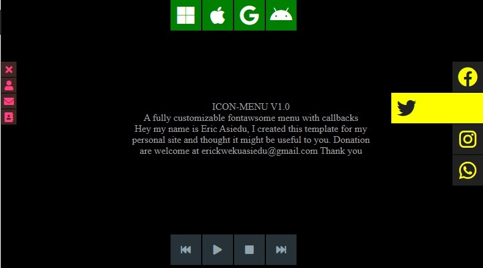

## ICON-MENU V1.0
A fully customizable fontawsome menu bar with callbacks.
Hey my name is Eric Asiedu, i created this template 
for my personal site and thought it might be useful to you.
Donation are welcome, paypal erickwekuasiedu@gmail.com Thank you


## INSTALL-

1. link fontawsome and icon-menu.css in your header
2. link icon-menu.js script at the end of body tag
3. now you can call makeBar() from any where in your script


## USAGE - Create an object with the following properties and pass it to makeBar function.

	layer 			: <string,required> 	ID of html element to use as a container.
	icons 			: [<string,required>] Array of fontawsome class string.
  	direction		: <string,required> use one of these (left,right,top,bottom).
  	hrefs			: [<string>,optinal] 	Array of urls to match each icon.
  	clicks			: [<callback,optinal>] 	Array of callback functions to match each icon.
  	fontSize		: <string,optinal> controls the size of the icons. add css units eg. "10pt" or "1.5rem"..
  	boxSize			: <string,optinal> controls size of box. add css units eg. "50px" or "10%" ...
  	colorA			: <string,optinal> base background color. any css color type
  	colorB			: <string,optinal> mouse over background color any css color type
  	stretchAmount		: <string,optinal> the amount to stretch button on mouse over. 50px or 10% ...
  	transition		: <string,optinal> controls animation speed. eg. "all 500ms ease-out"


## EXAMPLE - using hrefs

__HTML__

````html
 <div id="bar1"></div>
````


__JavaScript__

````javascript 
const options = {
  layer		: 'bar1', 
  icons		: ['fab fa-facebook','fab fa-twitter','fab fa-instagram','fab fa-whatsapp'],
  hrefs		: ['http://facebook.com','http://twitter.com','http://instagram.com','http://whatsup.com'],
  direction	: 'left',
  fontSize	: '2rem',
  boxSize	: '50px',
  colorA	: '#263238',
  colorB	: '#90a4ae',
  stretchAmount	: '100px',
  transition	: 'all 500ms ease-out'
};

makeBar(options);
````


## EXAMPLE - using callbacks

__HTML__

````html
 <div id="bar1"></div>
````


__JavaScript__

````javascript 
//bar clicks
const play 	= function(){alert("play")}
const stop 	= function(){alert("stop")}
const back 	= function(){alert("back")}
const forward 	= function(){alert("forward")}

const options = {
  layer		: 'bar1', 
  icons		: ['fas fa-fast-backward','fas fa-play','fas fa-stop','fas fa-fast-forward'],
  clicks	: [back,play,stop,forward],
  direction	: 'top',
  fontSize	: '1rem',
  boxSize	: '50px',
  colorA	: '#263238',
  colorB	: '#90a4ae',
  stretchAmount	: '10px',
  transition	: 'all 500ms ease-out'
};

makeBar(options);
````


